# Authentication Flow Diagrams

## Login Flow Sequence Diagram

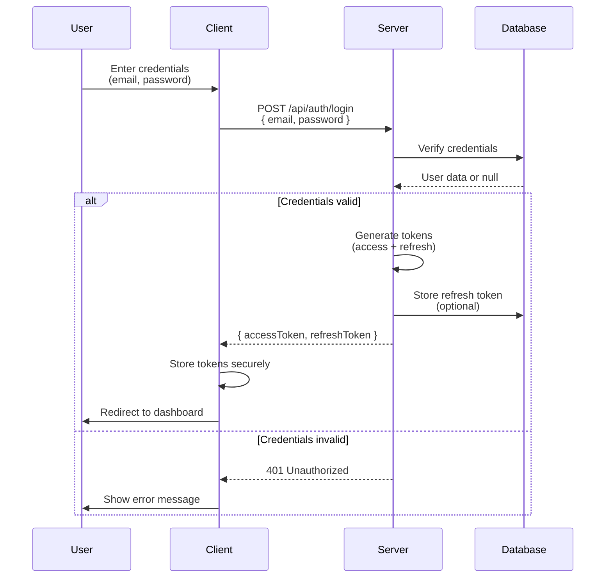

## Token Refresh Flow

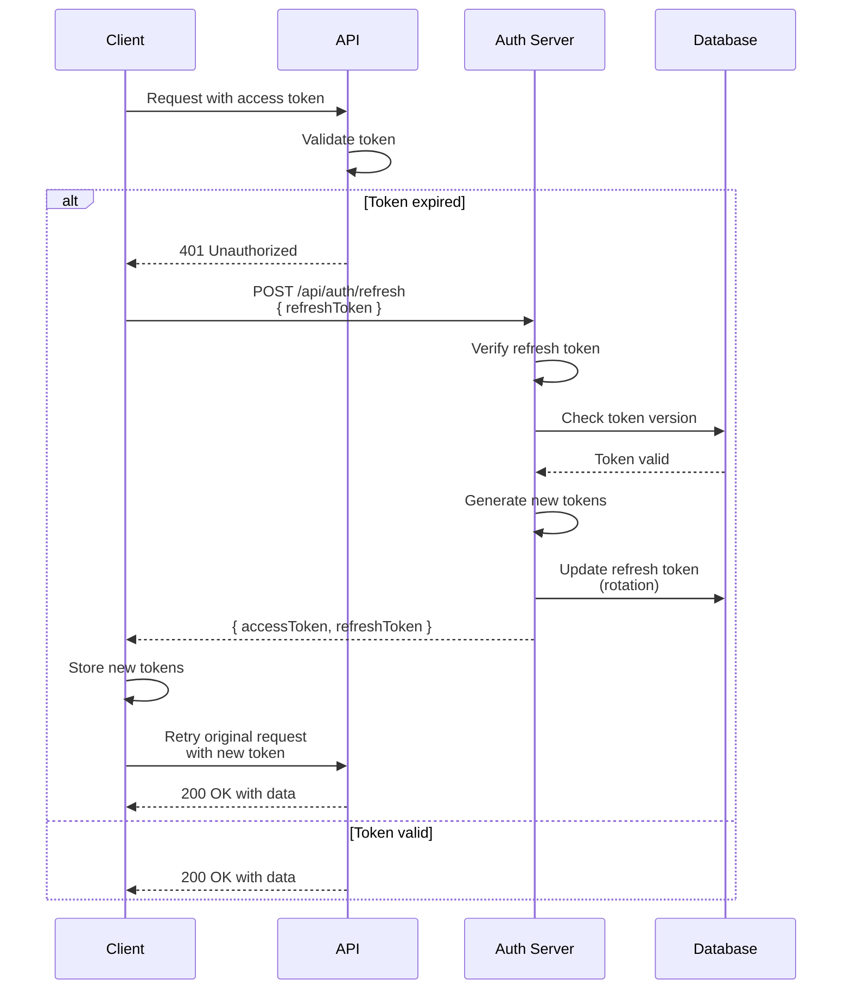

## Middleware Execution Flow

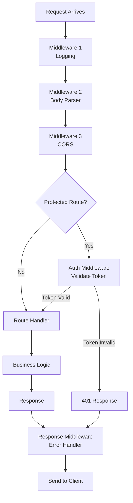

## Session vs Token Authentication

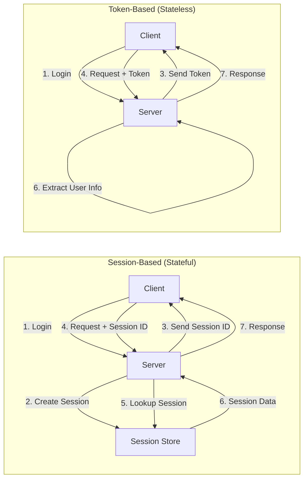

## Token Structure (JWT)

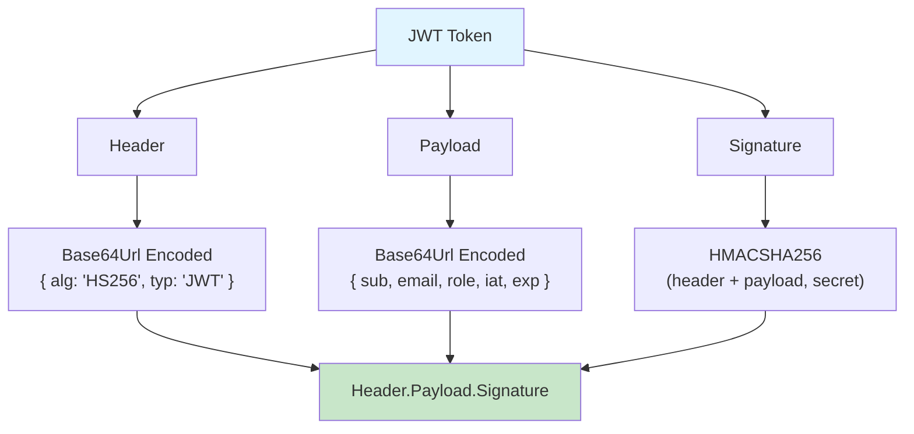

## Request Flow with Axios Interceptors

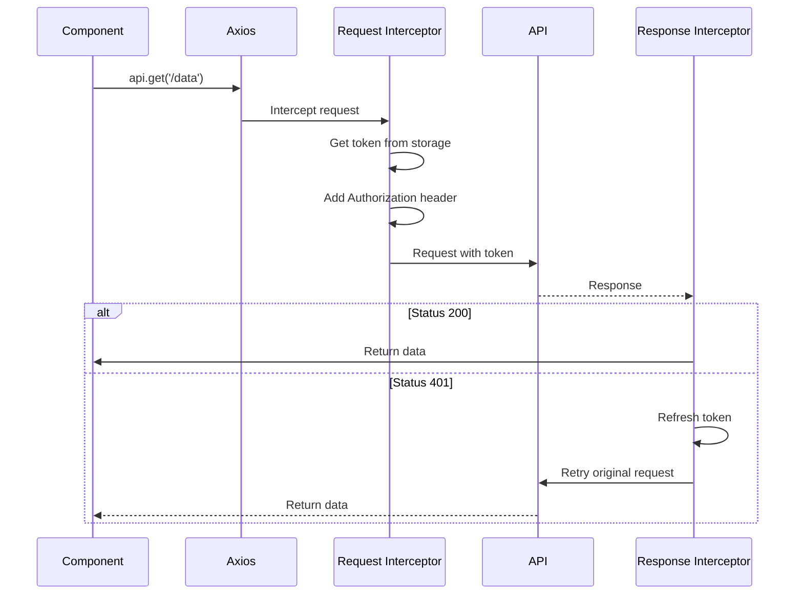

## Protected Route Flow (Next.js)

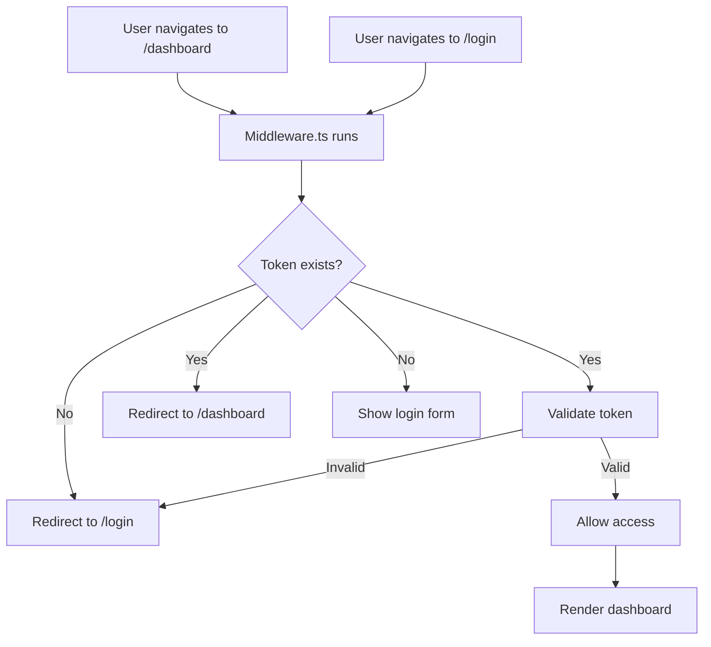

## Token Storage Comparison

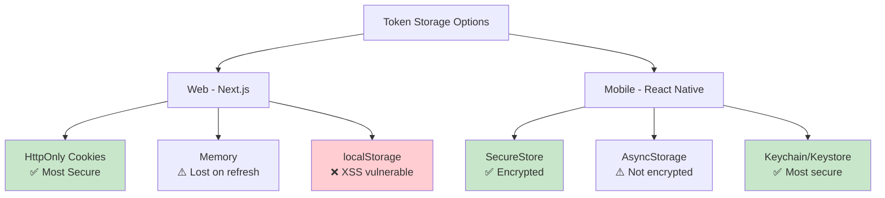

## Complete Authentication Lifecycle

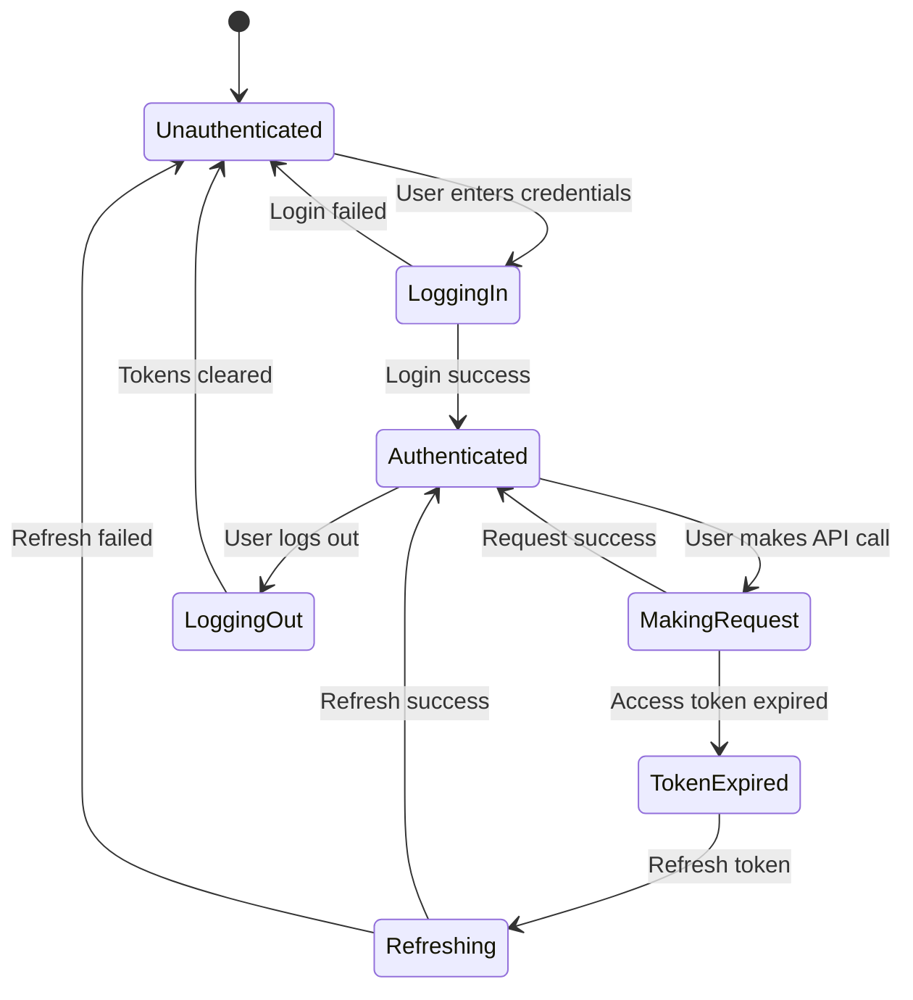

## Middleware Chain Visualization

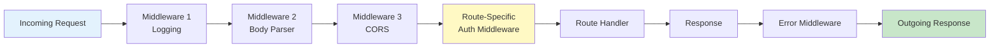

## Token Rotation Flow

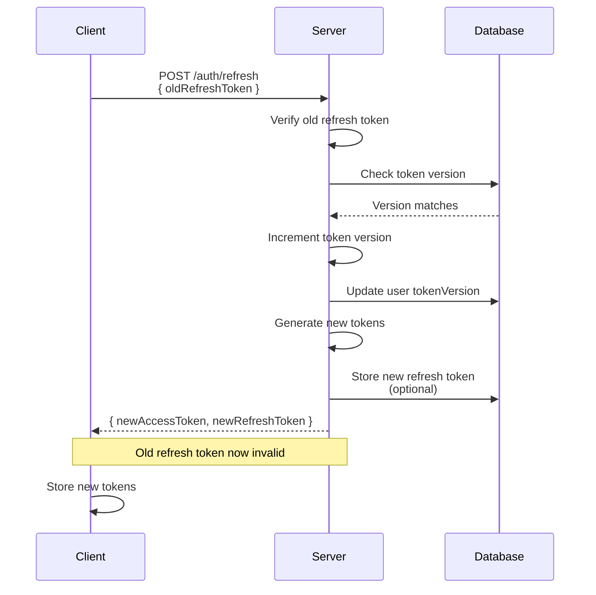

