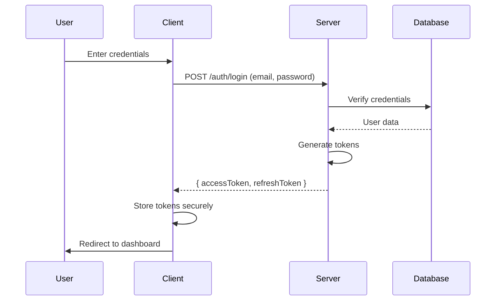
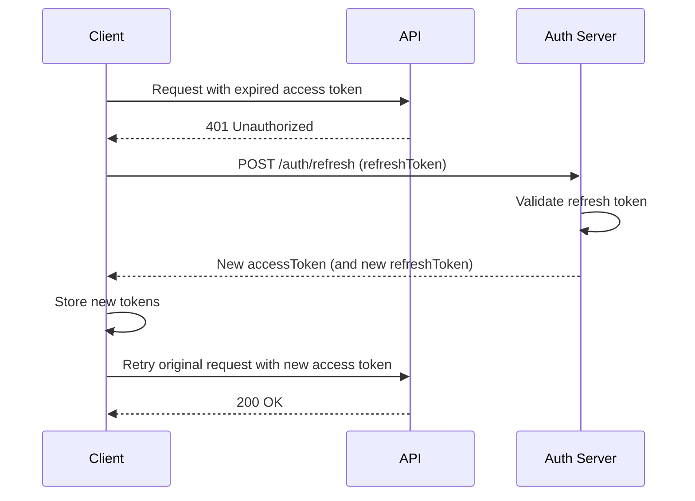
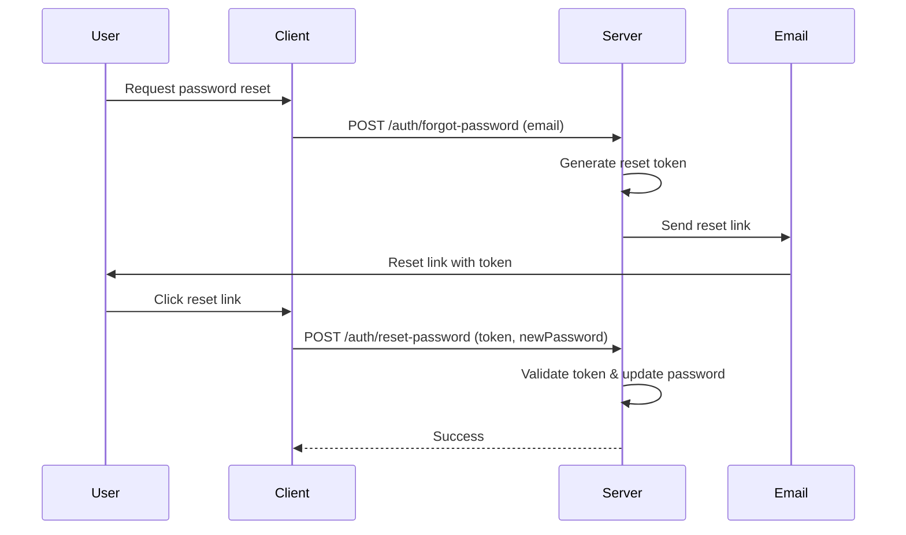
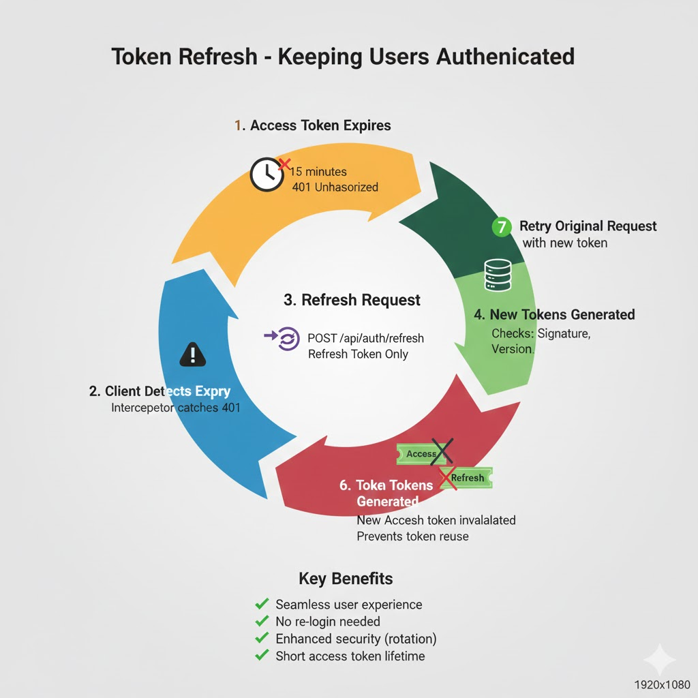

# Module 3: Authentication Flows

> **Complete implementation of login, registration, token refresh, logout, and password reset flows**

---

## Login Flow

**Complete Login Flow**:



**Implementation**:

```typescript
// Client-side (Next.js)
async function login(email: string, password: string) {
  const response = await fetch('/api/auth/login', {
    method: 'POST',
    headers: { 'Content-Type': 'application/json' },
    body: JSON.stringify({ email, password }),
  });
  
  if (!response.ok) throw new Error('Login failed');
  
  const { accessToken, refreshToken } = await response.json();
  
  // Store tokens (platform-specific)
  await storeTokens(accessToken, refreshToken);
  
  return { accessToken, refreshToken };
}

// Server-side (Express)
app.post('/api/auth/login', async (req, res) => {
  const { email, password } = req.body;
  
  // 1. Find user
  const user = await User.findOne({ email });
  if (!user) return res.status(401).json({ error: 'Invalid credentials' });
  
  // 2. Verify password
  const isValid = await bcrypt.compare(password, user.hashedPassword);
  if (!isValid) return res.status(401).json({ error: 'Invalid credentials' });
  
  // 3. Generate tokens
  const accessToken = generateAccessToken(user);
  const refreshToken = generateRefreshToken(user);
  
  // 4. Store refresh token (optional - for rotation)
  await storeRefreshToken(user.id, refreshToken);
  
  // 5. Return tokens
  res.json({
    accessToken,
    refreshToken,
    expiresIn: 900, // 15 minutes
  });
});
```

## Registration Flow

```typescript
// Client-side
async function register(email: string, password: string, name: string) {
  const response = await fetch('/api/auth/register', {
    method: 'POST',
    headers: { 'Content-Type': 'application/json' },
    body: JSON.stringify({ email, password, name }),
  });
  
  if (!response.ok) {
    const error = await response.json();
    throw new Error(error.message);
  }
  
  const { accessToken, refreshToken } = await response.json();
  await storeTokens(accessToken, refreshToken);
  
  return { accessToken, refreshToken };
}

// Server-side
app.post('/api/auth/register', async (req, res) => {
  const { email, password, name } = req.body;
  
  // 1. Validate input
  if (!email || !password || !name) {
    return res.status(400).json({ error: 'Missing required fields' });
  }
  
  // 2. Check if user exists
  const existingUser = await User.findOne({ email });
  if (existingUser) {
    return res.status(409).json({ error: 'User already exists' });
  }
  
  // 3. Hash password
  const hashedPassword = await bcrypt.hash(password, 10);
  
  // 4. Create user
  const user = await User.create({
    email,
    hashedPassword,
    name,
    role: 'user',
  });
  
  // 5. Generate tokens
  const accessToken = generateAccessToken(user);
  const refreshToken = generateRefreshToken(user);
  
  res.status(201).json({
    accessToken,
    refreshToken,
    expiresIn: 900,
  });
});
```

## Token Refresh Flow

**Why refresh tokens?**
- Access tokens expire quickly (security)
- Refresh tokens allow getting new access tokens without re-login
- Better user experience

**Flow**:



**Implementation**:

```typescript
// Client-side token refresh
class TokenManager {
  private accessToken: string | null = null;
  private refreshToken: string | null = null;
  
  async refreshAccessToken(): Promise<string> {
    if (!this.refreshToken) {
      throw new Error('No refresh token available');
    }
    
    try {
      const response = await fetch('/api/auth/refresh', {
        method: 'POST',
        headers: { 'Content-Type': 'application/json' },
        body: JSON.stringify({ refreshToken: this.refreshToken }),
      });
      
      if (!response.ok) {
        // Refresh token expired - need to login again
        await this.clearTokens();
        throw new Error('Refresh token expired');
      }
      
      const { accessToken, refreshToken } = await response.json();
      await this.storeTokens(accessToken, refreshToken);
      
      return accessToken;
    } catch (error) {
      await this.clearTokens();
      throw error;
    }
  }
  
  async getAccessToken(): Promise<string> {
    if (this.accessToken && !this.isTokenExpired(this.accessToken)) {
      return this.accessToken;
    }
    
    return await this.refreshAccessToken();
  }
}

// Server-side refresh endpoint
app.post('/api/auth/refresh', async (req, res) => {
  const { refreshToken } = req.body;
  
  if (!refreshToken) {
    return res.status(401).json({ error: 'Refresh token required' });
  }
  
  try {
    // 1. Verify refresh token
    const decoded = verifyRefreshToken(refreshToken);
    
    // 2. Check if token was revoked (if using rotation)
    const storedToken = await getStoredRefreshToken(decoded.sub);
    if (!storedToken || storedToken !== refreshToken) {
      return res.status(401).json({ error: 'Invalid refresh token' });
    }
    
    // 3. Get user
    const user = await User.findById(decoded.sub);
    if (!user) {
      return res.status(401).json({ error: 'User not found' });
    }
    
    // 4. Generate new tokens
    const newAccessToken = generateAccessToken(user);
    const newRefreshToken = generateRefreshToken(user);
    
    // 5. Update stored refresh token (rotation)
    await updateRefreshToken(user.id, newRefreshToken);
    
    res.json({
      accessToken: newAccessToken,
      refreshToken: newRefreshToken,
      expiresIn: 900,
    });
  } catch (error) {
    res.status(401).json({ error: 'Invalid refresh token' });
  }
});
```

## Logout Flow

**Simple Logout** (Client-side only):
```typescript
async function logout() {
  // Just delete tokens from client
  await clearTokens();
  // Redirect to login
  router.push('/login');
}
```

**Secure Logout** (Server-side revocation):
```typescript
// Client-side
async function logout() {
  try {
    // Notify server to revoke refresh token
    await fetch('/api/auth/logout', {
      method: 'POST',
      headers: {
        'Authorization': `Bearer ${accessToken}`,
        'Content-Type': 'application/json',
      },
      body: JSON.stringify({ refreshToken }),
    });
  } catch (error) {
    // Even if server call fails, clear local tokens
    console.error('Logout error:', error);
  } finally {
    await clearTokens();
    router.push('/login');
  }
}

// Server-side
app.post('/api/auth/logout', authenticateToken, async (req, res) => {
  const { refreshToken } = req.body;
  const userId = req.user.id;
  
  // Revoke refresh token
  await revokeRefreshToken(userId, refreshToken);
  
  res.json({ message: 'Logged out successfully' });
});
```

## Password Reset Flow



---

## Related Visuals

### Infographics



### Diagrams


---

## Navigation

- [← Previous: Token Types & Structure](../02-token-types-structure/02-token-types-structure.md)
- [↑ Back to README](../../README.md)
- [Next: Middleware Deep Dive →](../04-middleware-deep-dive/04-middleware-deep-dive.md)

