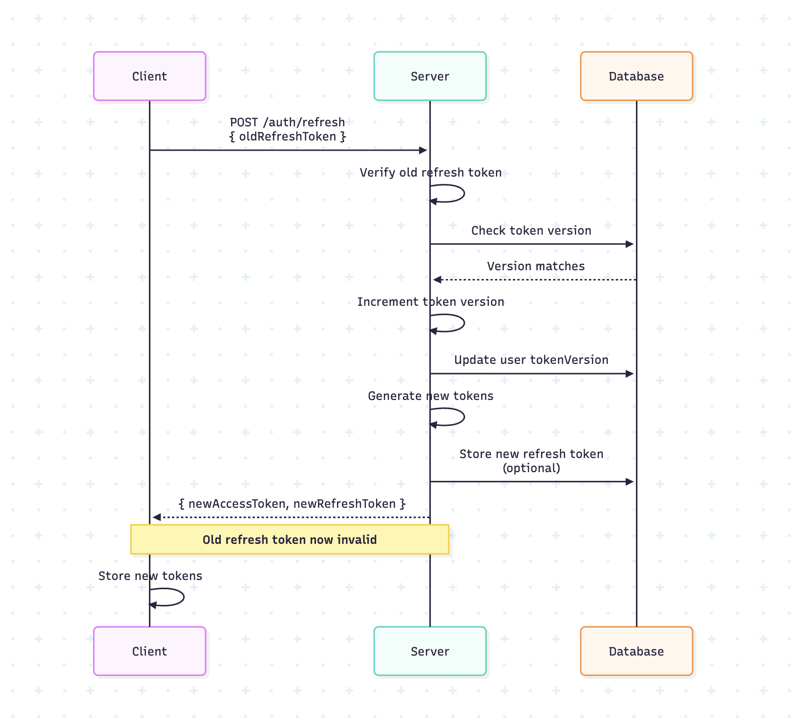

# Module 8: Security Best Practices

> **Security Best Practices**

---


### HTTPS Requirements

**Always use HTTPS in production!**

- Tokens transmitted over HTTP can be intercepted
- Use HTTPS for all API endpoints
- Set `Secure` flag on cookies (HTTPS only)

```typescript
// Cookie settings
cookies().set('accessToken', token, {
  secure: process.env.NODE_ENV === 'production', // HTTPS only in production
  httpOnly: true,
  sameSite: 'strict',
});
```

### Token Storage Security

**Web (Next.js)**:
- ✅ **Best**: HttpOnly cookies (not accessible to JavaScript)
- ⚠️ **Acceptable**: Memory (lost on refresh)
- ❌ **Avoid**: localStorage (XSS vulnerable)

**Mobile (React Native)**:
- ✅ **Best**: SecureStore (encrypted)
- ⚠️ **Acceptable**: AsyncStorage with encryption wrapper
- ❌ **Avoid**: Plain AsyncStorage for tokens

### XSS Protection

**Cross-Site Scripting (XSS)**: Attacker injects malicious JavaScript

**Protections**:
1. **HttpOnly cookies** - JavaScript can't access
2. **Content Security Policy (CSP)** - Restrict script sources
3. **Input sanitization** - Clean user inputs
4. **Avoid `dangerouslySetInnerHTML`** - Use safe alternatives

```typescript
// ❌ Vulnerable to XSS
<div dangerouslySetInnerHTML={{ __html: userContent }} />

// ✅ Safe
<div>{userContent}</div> // React escapes automatically
```

### CSRF Protection

**Cross-Site Request Forgery (CSRF)**: Attacker makes requests from user's browser

**Protections**:
1. **SameSite cookies** - Prevent cross-site requests
2. **CSRF tokens** - Validate on state-changing requests
3. **Origin checking** - Verify request origin

```typescript
// Set SameSite on cookies
cookies().set('accessToken', token, {
  sameSite: 'strict', // or 'lax'
  httpOnly: true,
  secure: true,
});
```

### Token Rotation Strategies

**Refresh Token Rotation**:
- Issue new refresh token on each refresh
- Invalidate old refresh token
- Limits damage if token is stolen

**Token Versioning**:
- Store version in user record
- Include version in token
- Increment on password change/logout all devices

```typescript
// User model
interface User {
  id: string;
  tokenVersion: number; // Increment to invalidate all tokens
}

// On password change
user.tokenVersion += 1;
await user.save();

// Token validation
if (decoded.tokenVersion !== user.tokenVersion) {
  throw new Error('Token invalidated');
}
```

### Platform-Specific Security

**Next.js**:
- Use middleware for route protection
- Server-side token validation
- HttpOnly cookies for refresh tokens

**React Native**:
- Use SecureStore (encrypted storage)
- Validate certificates (prevent MITM)
- Secure network communication

### Common Vulnerabilities

**1. Token in URL**
```typescript
// ❌ NEVER do this
fetch(`/api/data?token=${token}`);

// ✅ Use headers
fetch('/api/data', {
  headers: { Authorization: `Bearer ${token}` },
});
```

**2. Weak Secrets**
```typescript
// ❌ Weak secret
const secret = 'mysecret';

// ✅ Strong secret (environment variable)
const secret = process.env.JWT_SECRET!; // 32+ random characters
```

**3. Long Token Expiry**
```typescript
// ❌ Too long
{ expiresIn: '30d' }

// ✅ Short access token
{ expiresIn: '15m' } // Access token
{ expiresIn: '7d' }  // Refresh token
```

**4. Storing Sensitive Data in Tokens**
```typescript
// ❌ Don't store passwords, secrets
const payload = {
  sub: user.id,
  password: user.password, // NEVER!
};

// ✅ Only store necessary data
const payload = {
  sub: user.id,
  email: user.email,
  role: user.role,
};
```

---

## Related Visuals

### Infographics


### Diagrams



---

## Navigation

- [← Previous: Complete Implementation Examples](../07-complete-implementation-examples/07-complete-implementation-examples.md)
- [↑ Back to README](../../README.md)
- [Next: Practical Exercises →](../09-practical-exercises/09-practical-exercises.md)
